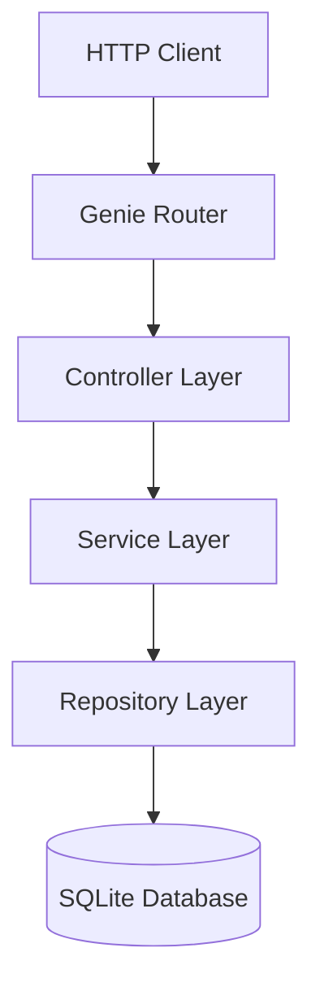

# Architecture of JuliaGenie

## High-Level Architecture

## Component Descriptions

### 1. Controllers (Handlers)
*   **Responsibility:** Handle HTTP requests, parse JSON input, call Services, and format HTTP responses.
*   **Technology:** `Genie.Router`, `Genie.Requests`, `Genie.Renderer.Json`.
*   **Location:** `src/controllers/`

### 2. Services (Business Logic)
*   **Responsibility:** Implement business rules, validations, and coordinate data operations.
*   **Technology:** Pure Julia functions.
*   **Location:** `src/services/`

### 3. Repositories (Data Access)
*   **Responsibility:** Direct interaction with the database. SQL queries, ORM calls.
*   **Technology:** `SearchLight.jl` (Genie's ORM) or `SQLite.jl` directly. We will use `SQLite.jl` or `SearchLight` depending on complexity, likely `SearchLight` to fit Genie better, or raw SQL if mandated by "Business Equal" strictness on control. *Decision: We will use SearchLight if it allows strict schema control, otherwise direct SQLite.*
*   **Location:** `src/repositories/`

### 4. Models (Entities)
*   **Responsibility:** Data structures representing Users and Tasks.
*   **Location:** `src/models/`
